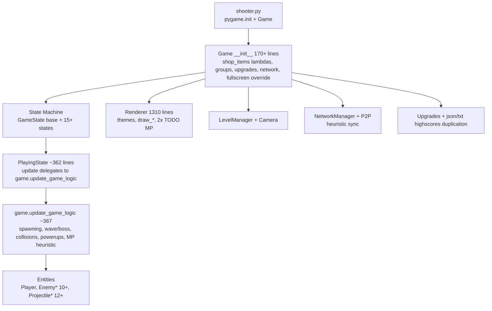
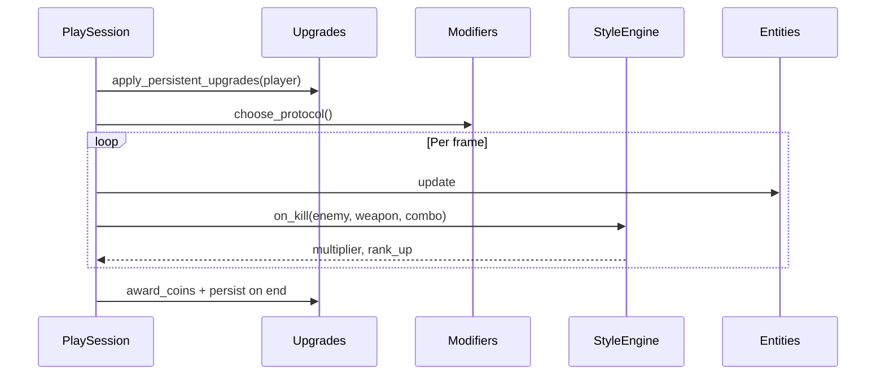

# Space Shooter: Stellar Vanguard (v3.0) Design Document

**Author:** Grok (Systems Architect, delegated)  
**Date:** 2026-06-02  
**Status:** Draft  
**Version Target:** v3.0 "Space Shooter: Stellar Vanguard (v3.0)" (full architectural modernization + content sequel to v2.0)

---

## Overview

This document outlines the design for a comprehensive "auto-rework" of the existing Python/Pygame space shooter (package `shooter.py`, main entry `shooter.py` calling `Game().run()`). The goal is a polished, full-featured sequel experience rather than incremental patches: systematic codebase cleanup, elimination of god-object and duplication debt, plus 2–4 major new gameplay pillars that justify the "sequel" feel while preserving the simple `python shooter.py` launch UX and single-player core fun.

The proposed solution (for "Space Shooter: Stellar Vanguard (v3.0)") introduces:
- A slimmed `Game` coordinator + dedicated `SimulationWorld` (extracted from `game.py:update_game_logic` and collision logic at ~367–699).
- Data-driven systems (WeaponRegistry, EnemyPoolRegistry, AssetManager) to make adding content touch 1–2 files instead of 5+.
- New pillars: Modular Ship Loadouts + Active Abilities; Deep Combo/Style/Rank system; Roguelite Run Modifiers (Vanguard Protocols); Interactive Environments & Destructibles.
- Content expansion: ~6–8 new enemy variants, ~4–5 new weapons, expanded campaign themes/bosses, 8+ power-ups, 20+ achievements.
- Polish: juice, feedback, basic accessibility.
- MP fate: fully de-scoped for v3.0 (experimental flag only, no new co-op of any kind; hidden or labeled experimental; no LAN/P2P enhancements or stubs); focus on single-player polish and replayability. (User decision: de-scope fully; strengthened language throughout.)
- Backward-compatible migrations for `upgrades.json` and high scores.

The result delivers a "new game" experience on the v2.0 foundation, runnable after each incremental PR.

---

## Background & Motivation

The current v2.0 (see `instructions.md`, `VERSION = "2.0"` in `config.py`) is already feature-rich:
- Modes: Campaign (10 themed levels via `LevelManager`, boss requirements), Arcade (endless), Survival, Challenge (stub), Multiplayer (LAN client-server + P2P via `NetworkManager`/`P2PNetworkManager` in `network.py`).
- Enemies: ~15+ types (basic + advanced Swarmer/Elite/Healer/Teleporter + variants turret/bomber/drone/zigzag/kamikaze) defined in `enemy_pools` dict (`enemies.py:9–20`) keyed by wave 1–10; subclasses + procedural fallback draw funcs.
- Weapons: basic (Bullet, Laser, Missile, Plasma, Bomb, Grenade) + advanced (Shotgun, Flamethrower, Lightning, BlackHole, FreezeBeam) with dedicated classes in `projectiles.py`; energy system on `Player`.
- Power-ups: 15+ types with set + timers (`player.py:62`).
- Persistent upgrades (11+ stats + 6 weapon-specific) via `upgrades.py` + `upgrades.json` (example: max_ammo level 3, damage 1.4).
- Economy, Level themes (9 in `config.py:66–75`, applied in `level_manager.py:_apply_theme_settings`), effects (shake, particles, slow-mo, dash), full state machine (`game_states.py`: 15+ states incl. `PlayingState ~362 lines`, `ShopState`, `MultiplayerMenuState`).
- ~6200 LOC core.

**Hotspots confirmed via exploration:**
- `game.py:1241` lines — `Game.__init__` enormous (shop_items list of 20+ dicts with lambdas + effects at ~131–165, sprite groups, upgrade application, highscore migration ~197–221, network init, timers). `run()` delegates to `self.state`. Many `buy_*` methods, `_generate_special_offers`. `update_game_logic` (~367), heavy collision/handling (~509+).
- `renderer.py:1310` — themed drawing, two `# TODO: Implement multiplayer player drawing` (`renderer.py:224,234`); virtual resolution scaling helper; `draw_playing` etc. `renderer_backup.py` exists (dead code, similar impl).
- `game_states.py:954` — `GameState` base, `PlayingState.update` (`~399–434`) calls `self.game.update_game_logic()` + `update_multiplayer`; heavy delegation to mutable `game`; `ShopState`, `MultiplayerMenuState` at end.
- `enemies.py:669`, `projectiles.py:596`, `player.py:450`, `network.py:613`.
- `shooter.py` (launcher) does windowed init then `Game()` overrides to fullscreen via `pygame.display.Info()` + `FULLSCREEN` (`game.py:27–31`).

**Pain points & technical debt (verified):**
- God-object: `Game` owns everything (logic, shop data with side-effect lambdas, persistence, MP state, timers). Adding weapon requires edits in `player.shoot` (`player.py:189+`), `projectiles.py`, `config.py`, shop_items in `game.py`, possibly renderer/calculate_damage.
- "In `PlayingState.update` (game_states.py:430), the game delegates heavy logic to `self.game.update_game_logic` which still lives in game.py:367 (spawning via `create_enemy`, wave/boss checks, collisions with custom `player_hitbox_collide`, powerup handling, achievements)."
- MP sync is heuristic/fragile (`game.py:1180–1215`): "find the closest enemy of the same type within a reasonable distance" (100px), health lerp 0.2, position 0.05; remote bullets cleared/recreated; server/client asymmetry; no reconciliation/snapshots; P2P uses STUN but incomplete (`network.py` + tests). Two TODOs in renderer. `MULTIPLAYER_README.md` admits "Basic Implementation", "Local Network Only".
- Duplication: high score loading (`shooter.py:28`, `game.py:197` (json+txt fallback), `game_states.py:558` GameOverState writes json); achievements reset in multiple places.
- Sound: best-effort per-file in `game.py:59–82` (shoot.wav etc.; no `sounds/` dir, many missing; `boss.wav` checked with `os.path.exists`).
- Assets: `utils.py:load_image_with_fallback` (inline draw lambdas in player/enemies); no central manager/cache; images/ has 36 PNGs + 3 mystery.
- Other: `apply_difficulty` ties to campaign; limited tests (`test_game.py` basic imports/init); no logging/settings persistence beyond upgrades; `renderer_backup.py`; forced fullscreen overrides launcher; some states (ContinuePrompt, Victory, BossIncoming) partially integrated.
- From greps: 54 classes (heavy inheritance on Sprite), many `except Exception: pass`, bare `pass` for TODOs, `colliderect` / `groupcollide` centralized in Game.

Current state feels like a strong v2 prototype with debt that blocks safe expansion and polish. A sequel requires both cleanup (to enable velocity) and new pillars (to feel like "v3 full featured").

---

## Goals & Non-Goals

**Goals (v3.0 must deliver):**
- Architectural modernization: slim Game (coordinator only), extracted Simulation/World, data-driven content registration, centralized AssetManager + logging stub, single source for highscores/upgrades.
- "Sequel" gameplay: 2–4 major new systems/pillars that add depth/replay without replacing v2 fun (loadouts+actives; combo/style; roguelite modifiers; environments).
- Content: specific new enemies (~6+), weapons (~4+), levels/themes/bosses, powerups, achievements.
- Polish targets: juice (hitstop, crit flash, enhanced particles), UI/animation feedback, basic accessibility (minimal per user: controller hints + optional mouse_aim flag as planned; cheap colorblind desaturate/remap stub in renderer (toggle in settings) if fits 1-2 hours; no full captions or high-contrast overhaul).
- Preserve UX: `python shooter.py` (or equiv) launch; identical default controls; runnable after every PR.
- Minimal new runtime deps (pygame primary; pygame-ce optional for wins like improved events/joystick if clear benefit; no compilation reqs).
- MP decision + rationale with clear scope for v3 (fully de-scoped per user: experimental flag only, no new co-op).
- Migrations that preserve existing player progress (`upgrades.json` values/levels, highscores).
- Quantified targets: stable 60 FPS with 80–120 entities (hybrid adaptive: default nice visuals; auto LOD/cull e.g. particle scaler or far-entity skip when FPS <55 for 3s sustained per user decision); <50ms input-to-render latency in common cases; upgrade persistence schema v2+. (Perf target updated for hybrid per user.)
- Concrete, testable: every section cites files/functions/patterns.

**Non-Goals (out of scope for v3.0):**
- Full internet matchmaking or dedicated servers (LAN/P2P experimental only).
- Complete rewrite from scratch or replacement of pygame sprites with full ECS (overkill; see Alternatives).
- Mobile ports, web, console; desktop Linux/macOS/Windows via Python only.
- Perfect netcode rewrite (would be separate large effort).
- Replacing all existing content or changing core "top-down energy shooter" feel.
- New heavy deps (e.g., no numpy/pandas unless already implicit).

**Success metrics:** Game feels "new and higher-quality" in playtests; adding a weapon touches ≤2 files; all v2.0 progress migrates cleanly; each PR leaves `python shooter.py` runnable and better.

---

## Proposed Design

### Current Architecture (Simplified)



Pain: mutable shared state, logic+UI+persistence in one class, content registration scattered.

### Proposed v3 Architecture

Introduce clear boundaries. Keep pygame Sprite OO (no full ECS). Add thin layers for systems.

```mermaid
flowchart TD
    Launcher[shooter.py\nminimal init + Game] --> Coord[Game Coordinator\nslim __init__, state machine owner, persistence facade, run loop]
    Coord --> SM[StateMachine\nstates now thinner, focused on UI/input]
    SM --> Playing[PlayingState\ninput + delegates to session]
    Playing --> Session[PlaySession / SimulationWorld\nnew: owns entities, update_logic, collisions, spawning, rules]
    Session --> Registries[(WeaponRegistry\nEnemyPoolRegistry\nPowerUpCatalog\ndata-driven)]
    Session --> Entities[Entities\nPlayer (loadout component), Enemy*, Projectile*]
    Coord --> Assets[AssetManager\nnew: load_image_with_fallback central, cache, sounds]
    Coord --> Renderer[Renderer\nenhanced virtual res, no god refs, MP drawing impl]
    Coord --> Persist[Persistence\nmigrations, single highscores.json + schema]
    Coord --> Upgrades[Upgrades\nschema v2, levels+values]
    Session --> LevelMgr[LevelManager\nprocedural + themes]
    Coord --> optional[Optional: MPExperimental\nbehind flag, better snapshot or removed]
    Assets --> Images[images/ + fallbacks]
```

**Key changes & concrete mappings:**
- `game.py`: Reduce to ~400 lines. `__init__` becomes coordinator setup (no 20+ shop lambdas; load from `ShopCatalog`). Move `update_game_logic`, collisions, `create_enemy`, `handle_enemy_death`, `calculate_damage` → `simulation.py:SimulationWorld`.
  - Example: `self.session = SimulationWorld(self, game_mode, upgrades_snapshot)`.
  - Shop items become data + pure effects (no direct `setattr` on player from Game).
- New `simulation.py`: Class holding sprite groups? or lists + update. `def update(self, dt): spawn, all.update, collisions (move player_hitbox_collide here), powerup apply, style scoring.`
- `assets.py` (or extend `utils.py`): `class AssetManager: def load_image(...), def get_sound(name) -> optional, cache, theme-aware fallbacks.`
- Content registration: In `config.py` or new `data/weapons.json` + registry. E.g.:
  ```python
  # weapons.py or registry
  WEAPON_REGISTRY = {
      WEAPON_SHOTGUN: {"class": ShotgunBullet, "energy_cost": 3, "unlock": ...},
      ...
  }
  # player.shoot: w = WEAPON_REGISTRY[self.weapon]; ...
  ```
  Adding weapon: register here + define class + (optionally) shop entry data. No edits to Game shop list.
- `player.py`: Add `Loadout` component (or subclass strategy). `active_abilities = []`; `use_ability(slot)`. Energy/dash/powerups stay; integrate with loadout base stats.
- `enemies.py` / `projectiles.py`: Keep mostly; add new subclasses. Use registries for pools.
- `game_states.py`: `PlayingState` stays but thinner (input only; no logic). `ShopState` uses catalog. New `LoadoutSelectState`, `ModifierChoiceState`.
- `renderer.py`: Implement the two TODO MP methods (or stub if de-scoped). Enhance juice hooks (e.g. `on_crit` callback for flash).
- `level_manager.py`: Extend for new themes, environmental data.
- Persistence: `persistence.py` centralizes json load/save with versioned migrations. Highscores: single authoritative load in one place; GameOverState calls it.
- `upgrades.py`: Add `SCHEMA_VERSION = 2`; `load` handles v1 (old dict) -> v2 (values+levels + missing keys like energy_regen from current json).
- MP: In `config.py` add `ENABLE_EXPERIMENTAL_MP = False`. Menu entry gated. If False, hide or label "LAN (Experimental)". Network code stays but no longer primary path.

**Data flow for progression (Mermaid):**



**Loadout example interface (new):**

```python
# proposed in player.py or loadouts.py
class Loadout:
    def __init__(self, archetype: str):
        self.archetype = archetype  # 'scout', 'gunner'...
        self.base_stats = {...}
        self.actives = [Ability("boost"), Ability("emp")]

    def apply_to(self, player):
        player.speed += self.base_stats['speed']
        ...

# In reset_game / session start:
loadout = player.selected_loadout or default
loadout.apply_to(self.player)
```

**Campaign vs Arcade/Survival Integration (new subsection resolving Issue 4)**

Pillars are explicitly "layered on top" of the existing 10-level campaign (see Goals, Background: "Campaign (10 themed levels via `LevelManager`, boss requirements)", game.py:369: `if self.game_mode == MODE_CAMPAIGN: ... level_manager.is_level_complete()` vs else wave/score logic at 382-387; create_enemy uses level_or_wave = level_manager.current_level if CAMPAIGN else wave).

- **Loadouts (PR6)**: Selectable pre-run (new LoadoutSelectState). Applied uniformly in reset_game and PlaySession.__init__ / start (affects base stats for *all* modes, including campaign level starts and boss fights). No change to level_manager.start_level(1) calls in game_states.py:105/135 or unlocks (still via coins/achievements). Campaign progression (10 levels, boss requirements) unchanged; loadout just makes the ship stronger/weaker per choice.
- **Roguelite Modifiers (PR8)**: "3 choices post-wave in Arcade/Survival" (new ModifierChoiceState after wave complete or in update_game_logic). For Campaign: choices offered after level complete (in VictoryState or before next_level) or never (to preserve strict 10-level structure); if offered, persist for the run (affect subsequent levels' sim). Modifiers do *not* alter level_manager objectives (is_level_complete/get_level_reward at level_manager.py:266-336 still use enemies_killed_this_level, boss check, objective_type like 'no_damage'/'survive_time'/'collect_powerups' from _generate_level_data). Modifiers can boost style/coins but environmental kills etc. feed style only.
- **Style/Combo (PR7)**: Expanded in sim on_kill (weapon variety, chains, env kills). Feeds score/coins/multipliers. Interacts with campaign by adding "style bonus" to get_level_reward performance_bonus (extend level_manager.py lightly if needed), but does not change completion conditions (e.g. no_damage objective still checks damage_taken_this_level ==0). Arcade/Survival use same engine + endless rank ups.
- **Interactive env (PR9/10)**: Enhanced asteroids/hazards in sim (mineable yield in handle_enemy_death style, clouds slow via freeze-like, reflect in projectile update). "campaign extension or procedural + 2 new bosses". Updates to level_data / _apply_theme_settings (level_manager) for env flags per theme; boss spawn logic (game.py:433) unchanged. Campaign levels can have env objectives indirectly (e.g. more resources from miners). Arcade uses for replay variety. level_manager objectives unchanged unless new 'env' type added post-v3.

Table (system | Arcade/Survival | Campaign):
- Loadouts | Pre-run select, affects all waves | Pre-run select, affects all 10 levels + bosses
- Modifiers | Post-wave choice, session-long | Post-level (optional) or none; run-long if chosen
- Style | Endless rank, score mult | Per-level + final reward bonus; does not gate completion
- Env/Destructibles | Hazards always on | Theme-specific (via level_manager); extra for style/objectives

See PR6/8/10/11 descs for 2-3 sentence integration notes + pseudocode. level_manager examples extended in design (current _generate_level_data etc. preserved).

Quantification (estimates, based on v2 play):
- Expected load: Arcade survival to 10min ~150 entities peak; target maintain 55+ FPS (pygame + 60 cap).
- Latency: Input handling in state → session update same frame; aim <16ms.
- Storage: upgrades.json ~1KB; highscores 10 entries ~2KB; no bloat.
- New content: 6 enemies x ~30 LOC each = 180; 4 weapons x 40 = 160; 5 themes/levels data + 2 bosses ~300; total added ~2–3k LOC but offset by cleanup.

**Risks (severity/mitigation):**
- High: MP breakage on refactor — Mit: gate behind flag early; test harnesses remain; deprecate path first.
- Med: Feel change from loadouts/modifiers — Mit: defaults match v2 stats exactly; modifiers optional/choosable; playtest matrix.
- Med: Performance with new particles/juice — Mit: PARTICLE_LIMIT already 200; profile in PRs; culling.
- Low: Migration edge cases — Mit: versioned, unit tests for load old json.

---

## API / Interface Changes

**Before (scattered):**
- `player.shoot()` hard-coded ifs for 10+ weapons + powerup synergies.
- `game.shop_items = [ {"name":..., "effect": lambda: setattr... } ... ]` (20+).
- `game.create_enemy()` + `enemy_pools` + manual ifs for subclasses.
- Highscore read/write duplicated.

**After (examples):**
```python
# config.py or data
WEAPONS = { WEAPON_SHOTGUN: WeaponDef(energy=3, class_=ShotgunBullet, ...), ... }

# player.py
def shoot(self):
    if not self.can_shoot(): ...
    defn = WEAPON_REGISTRY[self.current_weapon]
    proj = defn.spawn(self.rect.right, self.rect.centery, game=self.game, **synergies)
    self.energy -= defn.energy_cost
    ...

# simulation.py (new)
def spawn_enemy(self, wave_or_level):
    et = ENEMY_POOLS.get(...).choice()
    e = ENEMY_FACTORY[et](self.game)
    ...

# shop becomes
shop_catalog = ShopCatalog()  # loads from data or code consts, returns buyable list with pure effects
cost = shop_catalog.get_cost(key)
if coins >= cost:
    shop_catalog.apply(key, player, upgrades)  # no lambdas on game
```

States: `handle_event` remains; new states for loadout select (`LoadoutSelectState`) and modifier choice (`ModifierChoiceState`).

Renderer draw calls gain optional `on_hit` / `style_event` params for juice.

No breaking changes to public launch or save data (migrations inside).

---

## Data Model Changes

- `upgrades.json`: **Extend the existing levels-based v1/v2 handling in upgrades.py** (no top-level "schema" today). Current logic (verified in upgrades.py:9-45): `__init__` seeds defaults including 'energy_regen'; `load()` does `if 'levels' in data: self.data = data['values']; self.levels = data['levels'] else: # Old format, convert... for key in self.data: ... compute level from base/increment, set self.levels[key]`. `save()` always does `json.dump({'values': self.data, 'levels': self.levels}, f)`. `upgrade()` increments levels and applies diminishing returns. `get_upgrade_cost()` uses levels. `get_level()`, `get_base_value()`, `get_increment()` support it. The on-disk `upgrades.json` example (with "values" and "levels", e.g. max_ammo level 3) already matches new format. Extend to add explicit `schema_version: 2` at top (or in a wrapper), support new keys (loadout progress, etc.), and centralize in persistence.py. Preserve all existing values/levels on upgrade.
- High scores: Deprecate `highscore.txt`; migrate on first load to `highscores.json`. There are currently three loaders: (1) `shooter.py:28-32` (simple `json.load` or `[0]*5`); (2) `game.py:197-221` (try highscores.json with {'scores': [{'score':, 'date':}]}, fallback highscore.txt plain ints, build list + sort[:10]); (3) `game_states.py:558-582` (GameOverState.enter: load/create {'scores': [...]}, append entry with date, keep top10, write, update in-memory). Central `PersistenceManager.load_high_scores()` / `save_high_score(score, mode=None)` will unify (return list of dicts `{"score": int, "date": iso, "mode": str?}`), with before/after migration for the three.
- New: Optional `settings.json` for volumes, difficulty default, colorblind_mode, mouse_aim (future).
- Enemy/weapon data: Move pools from `enemies.py` dict + hardcoded to registry + optional JSON for tuning (but keep code-first for v3 to avoid new files unless needed).
- Player progress: Add `selected_loadout` and `unlocked_archetypes` (and future achievement flags, run stats) under the existing upgrades.json "values"/"levels" or a parallel "progress" section; migrate cleanly (start empty for new installs, preserve old upgrades data).
- Save evolution (per user decision): Introduce a tiny persistence helper that can evolve (e.g. current + future support for compressed or binary). The new persistence.py (PR3) is a small facade that today writes/reads JSON (with schema), but has clear extension points or versioned writers for future compressed/binary without changing call sites.

Migration strategy: On `Upgrades.load` (or new Persistence) / Game init / first run: detect old (no 'levels' or no schema), backup the file (e.g. upgrades.json.bak), apply transforms (convert + inject defaults for new keys like loadout fields), log "Migrated upgrades v1->v2, added X keys". Same unified path for highscores (dedupe the three loaders). Add explicit migration tests that run in every PR touching progress (extend test_game.py pattern with mock data). Test roundtrips for old json, current new format, and post-v3 with loadouts. Persistence facade designed for evolution (JSON today, pluggable writers tomorrow).

---

## Alternatives Considered

1. **Pure incremental patches on v2 (no "sequel" pillars)**: Trade-off — lowest risk, keeps exact feel, ships faster. But fails "full featured sequel" request; debt remains, adding content stays painful (5-file edits). Rejected: does not deliver "new game" sensation or modernization.

2. **Full greenfield rewrite (new repo, new engine abstractions from day 1)**: Could use better patterns immediately. Trade-off — clean slate, but loses all v2 polish/juice/assets/known-good balance; high effort (reimplement 15 states, 20 enemies, MP stubs); risk of never shipping or "feels different". Rejected for scope; this is rework of existing.

3. **Introduce full ECS (e.g., via esper or custom) + component systems for everything**: Modern, data-oriented, great for many entities. Trade-off — decouples perfectly, easy serialization. But pygame Sprite groups/collisions are core perf path; massive refactor (every entity file + renderer + game logic); overkill for this 2D top-down; learning curve for team. Selected: "ECS-lite" via registries + thin SimulationWorld (composition where helpful, e.g. Player has Loadout component) while keeping Sprite inheritance for compatibility. Allows incremental.
   Note that even the selected path touches most entity + renderer files over the 12 PRs (PR2 sim extract, PR3 registries, PR5 loadout component, PR6/8/9/10 touches to entities/renderer); the advantage is incremental value and lower per-PR risk vs. a single massive change.

4. **Keep MP as first-class and invest in proper netcode (snapshots, client prediction)**: Would make multiplayer pillar. Trade-off — ambitious per existing code. But current is too broken (heuristic <100px matching will desync badly with new enemies); P2P NAT flaky; diverts from single-player polish that makes sequel feel good. Decision: experimental only.

---

## Security & Privacy Considerations

Threat model: Primarily local single-player desktop game. No server auth in core path.
- Local saves (`upgrades.json`, `highscores.json`): No exec of content; plain JSON. Validate on load (types, ranges, schema). Cap highscore list at 10 to prevent bloat.
- MP (if experimental enabled): TCP/UDP from untrusted peers. Validate all incoming messages (type checks, bounds on x/y/health, no arbitrary code). Rate limit updates. No shared state mutations from network without server authority (keep server authoritative where possible). Player data (name, score) only; no PII.
- Assets/sounds: Best-effort load from known paths; no user-provided files executed.
- No network by default (flag gated); no telemetry.
- Privacy: Local only. Highscores contain only score+date+optional mode. No accounts.

Mitigations: Add `validate_message` in network paths; sandboxed loads; document "LAN only, firewalled".

---

## Observability

- Logging: Introduce `logging.getLogger("shooter")` in new `utils/logging.py` stub. Replace key `print`s (errors, MP connect, migrations) with `logger.info/debug/error`. Levels: INFO for major events (level complete, upgrade buy, MP start), DEBUG for per-frame if enabled.
- Metrics (in-memory for v3, exposed via debug key or log on exit): FPS via clock, entity counts (`len(enemies)`, particles), session duration, kill counts per type/weapon, average combo. `SimulationWorld` can expose `get_debug_stats()`.
- Alerting: None (single-player); on error in `run()` main loop, log full traceback + state (mode, level, wave) before quit.
- In-game: Existing combo/score; add optional debug overlay (F3) showing "entities: X | style: S | protocol: Y".
- Persistence events: Log "upgrades migrated v1->v2, 3 keys added".

Targets: No silent failures; all sound load failures logged once at init.

---

## Rollout Plan

- Feature flags: `config.py` bools `ENABLE_LOADOUTS = True`, `ENABLE_ROGUELITE = True`, `ENABLE_ENV_INTERACTIONS = True`, `ENABLE_EXPERIMENTAL_MP = False`. Toggle in code or (later) settings.
- Staged: PRs are the stages (see PR Plan). Each PR must:
  - Leave game runnable (`python shooter.py` starts to menu/arcade).
  - Pass existing tests + new unit for touched area.
  - Include manual smoke (launch, play 1 wave, buy 1 upgrade, check migration if applicable).
  - For any PR touching player progress/saves (esp. 3,6,10,11): include/run migration tests using old v1 json + current format (extend test_game.py).
- Rollback: Git revert of PR; since incremental, prior state always better than before. No DB schema hard locks.
- Beta: After PR11 (content complete), tag internal playtest build. Collect balance feedback on new enemies/weapons (spawn rates, health in `enemy_pools` / level_data). Use "Balance Protocol": implementer provides tuning sheet (csv of health/dmg/spawn per new entity), 3+ playthroughs of campaign 1-5 + arcade 5min, log issues.
- Test Requirements Matrix (in addition to per-PR): collision coverage + sim unit tests in PR2; e2e campaign objectives + level_manager hooks in PR11; perf for 150 ents + juice + new particles in PR12; full migration + launcher globals in PR3/12.
- Full: After PR12 + polish, update `VERSION = "3.0"`, `instructions.md`, release notes. (See new Campaign Integration subsection for pillar details.)
- Post-v3: MP can be promoted if community interest + netcode budget. (Per user: fully de-scoped in v3; experimental flag only, no co-op.)
- Post-PR2 checkpoint (in rollout and PR2): audit all groups/timers owned by sim (game.py:172-183 sprite groups + particles list + timers in update_game_logic 437-507 + player_hitbox_collide inside); move ownership where possible to SimulationWorld. Archive renderer_backup.py (1431 LOC dead code confirmed via ls/wc; git rm or mv to archive/ ).
- Distribution prep (Steam in PR12): per user decision on platforms.

---

## Open Questions

- Final game name/subtitle? Resolved by user: Adopt "Space Shooter: Stellar Vanguard (v3.0)" as the official name for the sequel. (Updates applied to title, metadata, Overview, Key Decisions, PR12, Open Questions note, Rollout, VERSION = "3.0", menus examples, etc.)
- Exact MP scope for v3.0? Resolved by user: De-scope MP fully for v3 (experimental flag only, no new co-op). (Strengthened de-scope language in Key Decision #2, MP section, PR12, Open Questions note, Rollout. No local co-op stub.)
- Target platforms beyond desktop Python? Resolved by user: Prepare for Steam (app manifest, icons, controller DB, basic overlay hooks) but no full launch. (Concrete tasks added to PR12 Distribution prep: steam_appid.txt stub/notes, pygame icon support/docs, SDL controller mappings, basic overlay friendly window handling. No Steamworks SDK or builds in v3.)
- Accessibility depth: Colorblind modes (protan/deutan/tritan filters on renderer)? Subtitles for all sfx? Controller-only mode tests? Resolved by user: Minimal (hints + mouse flag as planned; colorblind stub in renderer if easy). (Aligned PR10/PR12 and Key Decision #9: keep to controller hints + optional mouse_aim; add cheap colorblind desaturate/remap stub in renderer (toggle in settings) if fits 1-2 hours; no full captions/high-contrast.)
- Performance budget: Accept occasional drops below 60 on low-end, or add entity culling / LOD for particles? Resolved by user: Hybrid: default to nice visuals, auto LOD/cull when FPS <55 for 3s (simple adaptive). (Updated Goals/quantified targets + PR12 perf pass: simple FPS watcher + particle scaler or far-entity skip on sustained low FPS. Keep visuals rich by default.)
- Save format evolution: Keep simple JSON forever, or introduce protobuf/flat for v4+? Resolved by user: Introduce a tiny persistence helper that can evolve (e.g. current + future support for compressed or binary). (In PR3 and Data Model: persistence.py is small facade today JSON (with schema) + clear extension points/versioned writers for future compressed/binary, no call site changes. Updated PR3 Concrete Starting Point and migration notes.)

(Note: Input/controls, balance/tuning ownership, detailed testing strategy, audio architecture, and concrete pillar-to-campaign integration have been resolved into Key Decisions #9-13 and the new "Campaign vs Arcade/Survival Integration" subsection. Related prior open questions moved/closed here. All remaining Open Questions resolved by user answers below and incorporated as final decisions.)

## User Decisions (post-review)

User answers to remaining Open Questions (authoritative, recorded as final decisions):

- Title: Adopt "Space Shooter: Stellar Vanguard (v3.0)" as the official name for the sequel. (Updated in main title, Overview, Key Decisions, PR12, Open Questions, Rollout, VERSION notes, menus examples, etc.)
- MP: "De-scope MP fully for v3 (experimental flag only, no new co-op)" — Confirmed and strengthened de-scope language in Key Decision #2, MP section, PR12, Open Questions note, Rollout. No local co-op stub.
- Platforms: "Prepare for Steam (app manifest, icons, controller DB, basic overlay hooks) but no full launch" — Concrete tasks added to PR12 (Distribution prep bullet): steam_appid.txt stub/notes, icon support in pygame/docs, controller mappings via SDL, basic big-picture/overlay friendly window handling. No Steamworks SDK or builds in v3.
- Accessibility: "Minimal (hints + mouse flag as planned; colorblind stub in renderer if easy)" — Aligned PR10/PR12 and Key Decision #9: scope to existing controller hints + optional mouse_aim; cheap colorblind desaturate/remap stub in renderer (toggle in settings) if fits 1-2 hours; no full captions or high-contrast overhaul.
- Perf: "Hybrid: default to nice visuals, auto LOD/cull when FPS <55 for 3s (simple adaptive)" — Updated perf target in Goals/quantified + PR12 perf pass: simple FPS watcher + particle count scaler or far-entity skip when sustained low FPS. Keep visuals rich by default.
- Save: "Introduce a tiny persistence helper that can evolve (e.g. current + future support for compressed or binary)" — In PR3 (persistence) and Data Model: persistence.py is a small facade that today writes/reads JSON (with schema), but has clear extension points or versioned writers for future compressed/binary without changing call sites. Updated PR3 Concrete Starting Point and migration notes.

These are now final; Open Questions section below reflects resolutions.

---

## References

- `instructions.md` (v2.0 dev guide for adding enemies/weapons/levels/modes).
- `config.py` (all MODE_*, THEME_*, WEAPON_*, ENEMY_* consts; MP constants).
- `upgrades.json` (current player progress example).
- `game.py`, `game_states.py:PlayingState`, `renderer.py` (TODOs at 224/234), `player.py:shoot`, `enemies.py:enemy_pools`, `network.py` (sync logic ~1180), `level_manager.py`.
- `MULTIPLAYER_README.md`, `GRAPHICS_README.md`.
- `test_game.py`, `utils.py:load_image_with_fallback`.
- Prior art: Geometry Wars (combo/style juice), Vampire Survivors/Hades (roguelite choices), classic Raiden/1942 (themed levels + bosses).
- Pygame sprite/collision patterns as used throughout.

---

## Key Decisions

1. **Keep monolithic PlayingState or split simulation?** Split: Move logic to `SimulationWorld` (new file). Rationale: Directly attacks god-object; enables unit testing of rules independent of UI; states become pure input/render concerns. Matches "In PlayingState.update (game_states.py:430), the game delegates heavy logic to `self.game.update_game_logic` which still lives in game.py:367".

2. **Scope of MP for v3?** Fully de-scoped for v3.0: experimental flag only (ENABLE_EXPERIMENTAL_MP=False by default), hidden or clearly labeled as experimental in menus, no new co-op implementation (no local split-screen or otherwise). Rationale (strengthened per user decision): Current heuristic sync (closest same-type <100px, 0.2 lerp) is fragile and will break with new content/environments; full proper netcode (snapshots + reconciliation) is larger than sequel scope. No investment in MP features for v3.0 beyond the flag and de-scope. Preserves existing code investment for potential future (post-v3) if demand arises. (See MP section in Overview, PR12, Rollout, Open Questions note.)

3. **How to handle existing player progress?** Automatic migration on load with schema bump + backup. Rationale: User request implies respect for v2 investment (upgrades.json example shows progress). Non-breaking is explicit goal. (See updated Data Model for exact current upgrades.py:15-41 logic as base.)

4. **Whether to introduce ECS-lite or stay with sprite inheritance?** Stay with Sprite + introduce registries + optional components (e.g. Loadout on Player). Rationale: Lowest risk; pygame draw/collide groups remain efficient; full ECS would require touching every entity + renderer (high churn). ECS-lite via data registries achieves "add weapon without 5 files" goal.

5. **Preserve exact v2 balance/feel or allow tuning?** Preserve defaults exactly for core stats/movement; new systems layered on top and optional. Rationale: "Risk of breaking existing 'feels'" called out; muscle memory and known-good progression must survive to feel like sequel not reboot.

6. **Data-driven content vs code?** Hybrid: Registries in code (Python dicts for speed/simplicity) + consts; shop/powerup data can be list-of-dicts loaded at startup. Rationale: Matches instructions.md patterns; avoids new runtime file parsing complexity for v3; easy to move to JSON later.

7. **Centralized asset manager?** Yes, new `AssetManager` (or extension in utils.py) wrapping `load_image_with_fallback`. Rationale: Eliminates duplication of load paths/fallbacks; enables future caching, theme variants, sound preloading. Decision: extend utils.py (keep draw_func contract exactly: draw_func(surface, *draw_args); 25+ call sites in player.py:50, powerups.py:148, enemies.py:59-653 incl. 15+ draw_* lambdas + asteroid/boss; renderer.py:71 uses direct pygame.image.load for background only).

8. **PR granularity for incremental value?** 12 PRs, each adding runnable value (e.g. PR1 assets usable immediately). Rationale: "support incremental implementation (each PR should leave the game in a runnable, better state)."

9. **Input/controls model for v3 (mouse, rebinding, controller)?** Add optional mouse_aim (player faces mouse cursor when enabled, toggle in settings) behind flag in PR12 polish; no keyboard rebinding or full remapping in v3 (keep hard-coded K_* in game_states.py:368+, player.py:102+ and joystick handling); centralize key constants; controller hints in PR12. Accessibility scope aligned to minimal per user: hints + mouse flag as planned; cheap colorblind desaturate/remap stub in renderer (toggle in settings) if fits 1-2 hours; no full captions or high-contrast. Rationale: grep confirms zero mouse handling anywhere; current joystick support is stubby across states; preserves "identical default controls" UX; full input config is post-v3 (see Open Q resolved here). De-scope rebinding. (Accessibility per user decision.)

10. **Balance/tuning process and ownership?** Balance owner: implementer for PRs + documented conservative numbers (copy v2 patterns from enemy_pools/level_data) + tuning sheet + playtest protocol/notes included in PR10/PR11 content PR descriptions and post-PR9 beta per Rollout. Rationale: open q #311 resolved into process; avoids subjective "who" by making it explicit in plan.

11. **Detailed testing strategy?** Per-PR requirements (in "All PRs"): update relevant tests + add 1-2 new (e.g. collision coverage post-PR2 in simulation tests; e2e campaign 1-3 + objectives in PR11; perf profiling for 150 entities + new juice/particles in PR12). Expand test_game.py beyond current imports + mock Game() (add sim update/collide/shop mocks, migration tests for progress-touching PRs). Manual smoke matrix always. Rationale: current test coverage limited (verified); ensures quality incrementally without full suite early.

12. **Audio architecture beyond AssetManager?** In PR1: centralize all existing sfx loads (game.py:59-82 shoot/explosion/powerup/hit + boss.wav os.path.exists) into AssetManager.get_sound(name) which returns the Sound or None (log once); keep play() calls but guard. Add get_music() stub + pygame.mixer.music hooks. Theme sounds and new tracks de-scoped (no sounds/ dir confirmed). PR12 adds any remaining polish. Rationale: best-effort silent fails (to None) are the current state; centralize to fix duplication and observability.

13. **Concrete pillar-to-campaign integration (vs Arcade/Survival)?** See new dedicated subsection below. Loadouts apply uniformly in reset_game / session start (affects stats for campaign levels too); modifiers chosen post-wave only for non-campaign modes (or after level complete for campaign, but objectives in level_manager unchanged); style/env feed extra scoring/kills but do not alter is_level_complete / boss_required / get_level_reward (level_manager.py:266-336) unless explicitly extended. Rationale: preserves "10 themed levels with boss requirements" campaign structure (game.py:369-381 distinguishes MODE_CAMPAIGN using level_manager vs wave/score); new systems "layered on top". Resolved from open q.

---

## PR Plan (Implementation Sequence — 12 PRs)

All PRs:
- Branch from main.
- Update relevant tests + add 1–2 new tests.
- Manual smoke: launch, play 60s arcade, menu navigation, upgrade purchase, level transition.
- Update `instructions.md` if API changes.
- Leave `python shooter.py` runnable and strictly better (no regressions in core loop).
- For any PR touching player progress/saves (esp. 3,6,10,11): include/run migration tests using old v1 json + current format (extend test_game.py).

**Post-PR2 checkpoint (see Rollout):** audit all groups/timers owned by sim (game.py:172-183 sprite groups + particles list + timers in update_game_logic:437-507 + player_hitbox_collide inside); move ownership where possible to SimulationWorld. Archive renderer_backup.py (1431 LOC dead code; git rm or mv to archive/).

1. **PR1: Introduce AssetManager and centralize loading/sounds (w/ audio foundation)**  
   Files: `utils.py` (extend), `game.py` (remove per-file try/except), `player.py`/`enemies.py`/`projectiles.py` (use manager), `renderer.py` (backgrounds + direct load note), `powerups.py`.  
   Dependencies: none.  
   Description: New `AssetManager` (or class in utils.py) with `load_image`, `get_sound(name, fallback=None)`, cache, theme hooks. Move all `load_image_with_fallback` calls + sound loads (game.py:59-82 +170 boss check). Centralize pygame.mixer.Sound + set_volume; get_music() stub. Eliminates 20+ scattered excepts; sounds now logged (and None guarded). Addresses audio gap (no sounds/ dir, silent fails).  
   **Concrete Starting Point:**  
   a) Skeleton (add to utils.py):  
   ```python
   class AssetManager:
       def __init__(self):
           self._image_cache = {}
           self._sound_cache = {}
       def load_image(self, filename, size, draw_func=None, *draw_args):
           # exact current logic from load_image_with_fallback + cache + theme
           key = (filename, size)
           if key in self._image_cache: return self._image_cache[key]
           # ... try load or fallback draw_func(surface, *draw_args) ...
           self._image_cache[key] = img
           return img
       def get_sound(self, name):
           if name in self._sound_cache: return self._sound_cache[name]
           try:
               s = pygame.mixer.Sound(f'{name}.wav')
               # set volume etc.
               self._sound_cache[name] = s
               return s
           except: 
               print(f"Sound {name} missing"); return None
       def get_music(self): pass  # stub for PR12
   ```  
   b) Grep-derived sites to touch (25+): player.py:5,50 (draw_player); powerups.py:4,148 (draw_powerup for 15+ types); enemies.py:7 + 33-201 (15+ draw_* for normal/fast/big/.../teleporter + subclasses 481+), 321 boss, 653 asteroid; renderer.py:71 (background direct pygame.image.load -- leave or wrap); also calls in game init etc.  
   c) Before/after pseudocode for player.py:50 and one enemy.  
   d) Unit test sketch: test_load_missing_falls_to_draw; test_get_sound_none_on_missing.  
   Decision: extend utils.py (preserves draw_func contract exactly).  
   Complexity/Risk: Low. Runnable immediately. (Audio centralization here.)

2. **PR2: Extract SimulationWorld / PlaySession from Game**  
   Files: new `simulation.py`, `game.py` (slim update_game_logic call, remove collision logic), `game_states.py:PlayingState` (update still calls but thinner).  
   Dependencies: PR1 (assets if used in sim).  
   Description: `class SimulationWorld: ...` owns groups, `spawn_enemy` (uses registry stub), collisions (move player_hitbox_collide), `handle_enemy_death`, timers, powerup application. Game keeps high-level state. Enables future testing.  
   **Concrete Starting Point:** List of groups/timers to own from game.py:172-183 (all_sprites, enemies, powerups, asteroids, enemy_bullets, bullets, remote_bullets, missiles, plasmas, bombs, grenades, particles=[]); timers like enemy_timer, combo_timer etc in update. Before: def update_game_logic in game.py:367; after: self.session.update(dt).  
   Complexity/Risk: Med (careful with mutable player/game refs). Leaves arcade playable. (Includes post-extract audit checkpoint.)

3. **PR3: Persistence extract + highscore dedupe + basic schema + launcher globals (promoted early per review)**  
   Files: new `persistence.py`, `upgrades.py` (extend for schema), `game.py`/`game_states.py` (use for highscores), `shooter.py` (audit/remove dupe load/globals like high_scores, upgrades=Upgrades(), achievements, extra_lives, difficulty, stars), `test_game.py` (migrations).  
   Dependencies: none (parallel ok with PR1/2).  
   Description: Central PersistenceManager for load/save with schema_version=2. **Evolvable helper (per user decision):** persistence.py is a small facade that today writes/reads JSON (with schema + versioned readers/writers), but has clear extension points or versioned writers for future compressed/binary (e.g. pluggable backends) without changing call sites in Game/Upgrades/etc. Dedupe the 3 highscore paths (shooter.py:28-32, game.py:197-221, game_states.py:558-582) into one. Extend existing upgrades.py v1/v2 'levels' logic (exact: if 'levels' in data: ... else convert using get_base/increment; always save {'values':, 'levels':}). Migrate launcher globals into Game/persist. Add new keys support (loadout etc. for later PRs). Explicit migration tests. Update Data Model accordingly.  
   **Concrete Starting Point:** Persistence class skeleton with load_high_scores (unify the 3), save_high_score; upgrades load extension for schema + new keys; before/after for highscore loaders; test: load_old_no_levels_converts, load_current, roundtrip with loadout; example extension point: def _get_writer(self, format='json'): ... (for future 'compressed', 'binary').  
   Complexity: Low-Med. Critical early for "preserve progress"; prevents dupe migration logic in later PRs. (Highscore dupe fixed here; evolvable helper/facade per user decision: small JSON facade today with extension points for compressed/binary.)

4. **PR4: Data-driven shop + slim Game + remove lambdas**  
   Files: new `shop.py` (ShopCatalog), `game.py` (huge shop_items -> catalog load), `game_states.py:ShopState` (use catalog).  
   Dependencies: PR2, PR3 (for any progress in shop).  
   Description: ... (same as before, now after persis) Shop items as data dicts + pure `apply(player, upgrades)` methods. ...  
   Complexity: Low-Med. Runnable.

5. **PR5: Refactor state machine + introduce new state scaffolding**  
   Files: `game_states.py` (base tighten, Playing/Shop/Menu), `game.py` (change_state), new states stubs.  
   Dependencies: PR4 (shop).  
   Description: ... add `LoadoutSelectState` and `ModifierChoiceState` skeletons (empty UI). ...  
   Complexity: Low.

6. **PR6: Implement Modular Ship Loadouts + Active Abilities**  
   Files: new `loadouts.py` (archetypes + Ability base + 3–4 examples), `player.py` (integrate Loadout component, energy/actives), `game_states.py` (new select state), `simulation.py` (apply on start), `renderer.py` (ability cooldown UI).  
   Dependencies: PR2, PR3 (persistence for selected_loadout/unlocked), PR5.  
   Description: ... (updated) Stats override + upgrade stacking. ... selected_loadout persisted via PR3 mechanism (no separate progress.json). Campaign integration: applied in reset_game regardless of mode (see Campaign subsection).  
   **Concrete Starting Point:** Loadout class skeleton (archetype, base_stats, actives list, apply_to(player), use_ability); Ability base with cooldown; integration in player reset + sim start; test sketch for stacking with upgrades.  
   Complexity: Med. Core gameplay enhanced.

7. **PR7: Combo / Style / Rank system + juice foundation**  
   Files: new `style.py` (StyleEngine), `simulation.py` (on_kill hooks), `player.py`/`projectiles.py` (weapon variety tracking), `renderer.py` (rank badge, hitstop, crit flash), `game.py` (score paths).  
   Dependencies: PR2.  
   Description: ... (add: env kills feed style per PR9; interacts with campaign objectives via bonus in get_level_reward but no gate on completion).  
   Complexity: Med. Pure additive.

8. **PR8: Roguelite Run Modifiers (Vanguard Protocols)**  
   Files: new `modifiers.py`, `simulation.py` (apply temp buffs), `game_states.py` (choice UI after wave/ between levels), shop integration for some.  
   Dependencies: PR6, PR7.  
   Description: 3 choices post-wave in Arcade/Survival ... For campaign: after level (optional). See Campaign subsection.  
   Complexity: Med. High "sequel" value.

9. **PR9: Interactive Environments & Enhanced Destructibles**  
   Files: `enemies.py` (Asteroid upgrade), new `hazards.py` or in sim, `level_manager.py` (theme env data), `simulation.py` (interactions), `projectiles.py` (reflect etc.).  
   Dependencies: PR2.  
   Description: ... level_manager updates for env per theme; see Campaign subsection for objectives.  
   Complexity: Med. Visual + gameplay.

10. **PR10: Content expansion part 1 (registries + 2-3 enemies/weapons using new systems)**  
    Files: `enemies.py` (e.g. 2-3 new: Cloaker, Splitter + pools updates), `projectiles.py` (2 new: Railgun, SeekerSwarm), config + registries (implement WEAPON_REGISTRY/ENEMY_FACTORY from design examples), level_manager for any.  
    Dependencies: PR6–PR9 (use registries/loadouts/modifiers/env).  
    Description: Introduce full registries (concrete: full WeaponDef dataclass or dict with class, cost, unlock; ENEMY_FACTORY). Add 2-3 enemies/weapons as first using them. Balance numbers conservative. Campaign hooks if needed (see subsection).  
    **Concrete Starting Point:** Registry code in config.py or new data.py: WEAPON_REGISTRY = {WEAPON_SHOTGUN: {"class": ShotgunBullet, "energy_cost":3 , ...}}; spawn logic in player/sim; 1-2 test cases. Grep sites for pools: enemies.py:9-20.  
    Complexity: Med (lower risk slice of content).

11. **PR11: Content expansion part 2 (rest + bosses/themes/achievements + campaign polish)**  
    Files: `enemies.py` (remaining 3-5 new + pools), `projectiles.py` (remaining 2-3), `level_manager.py` + `config.py` (5 new themes + 3 bosses), powerups + achievements (20+), sim/game_states for hooks.  
    Dependencies: PR10.  
    Description: Specific remaining content, new bosses, achievements persistence (via PR3). "full featured". Update level_data / boss logic for env/campaign per subsection.  
    Complexity: High (volume) but split reduces risk. Runnable with old + part1 content.

12. **PR12: Polish, juice, UI, accessibility, input/audio stubs, settings, balance protocol, test matrix, MP gate + final docs/release**  
    Files: `renderer.py` (animations, transitions, colorblind filter stub, input mouse), `particles.py`, `game_states.py` (menus), `player.py`, `config.py` (flag + mouse_aim), `persistence.py` (settings.json), `test_game.py` (full), `shooter.py` clean, `instructions.md` etc.  
    Dependencies: PR11.  
    **Distribution prep (Steam) bullet (per user decision):** Add steam_appid.txt stub/notes (e.g. placeholder 480 for testing); ensure pygame icon support (or docs for .ico); controller mappings via SDL (pygame.joystick); basic big-picture/overlay friendly window handling (e.g. no forced fullscreen overrides, resizable hints). No actual Steamworks SDK, builds, or full launch in v3.0.  
    Description: Hit flashes... Sound stubs + get_music. Add optional mouse_aim (per Key Dec #9). Basic colorblind (cheap desaturate/remap stub in renderer with settings toggle if fits 1-2 hours; align to minimal scope per user: hints + mouse flag as planned; no full captions/high-contrast). Balance protocol + tuning sheet in content notes. Test matrix execution. Set ENABLE_EXPERIMENTAL_MP=False default; label (fully de-scoped, no co-op stubs). Full coverage, playthrough notes, version to 3.0. Archive backup if not earlier.  
    **Perf pass (per user):** Implement simple FPS watcher (e.g. in game loop or SimulationWorld); auto LOD/cull (particle scaler or far-entity skip) when FPS <55 for 3s sustained (hybrid: default nice visuals, adaptive only on low FPS). Keep visuals rich by default. Update quantified targets in Goals to reflect.  
    Complexity: Med. Leaves clean shippable state. (Includes Steam prep, minimal accessibility, hybrid perf, full MP de-scope.)

This plan supports independent value: after PR1 assets+audio better; after PR3 persistence safe for all later progress; after PR6 loadouts playable; after PR10/11 content; after PR12 it's the sequel. (Reordered per review for persistence before content; split PR9; added concrete starting points, checkpoints, archive, input/audio/testing/balance/launcher coverage; 12 PRs maintained.)

---

**End of Design Document.**

*All citations and references are to files/functions in /Users/spencereese/projects/shooter.py/ as explored via tools on 2026-06-02.*

---

## Appendix: Quick Stats from Exploration
- Core LOC: ~6200 in core listed files (game.py:1241, renderer.py:1310, game_states.py:954, enemies.py:669, projectiles.py:596, player.py:450, network.py:613, etc.; full *.py in dir higher ~ total lines across mains + tests/backup; 8 main files ~5833 per wc). renderer_backup.py (1431 LOC) explicitly archived in PR2.
- Classes: 54 (Sprite heavy).
- Known TODOs: 2 in renderer MP drawing.
- Sound assets: 0 dedicated dir; 5+ .wav attempted in game.py (best-effort to None).
- Images: 36+ in images/.
- No AGENTS.md / Claude.md / similar in shooter.py/ dir (confirmed via ls).

---

## Confirmation of Exploration Performed
- list_dir (project + images)
- read_file: instructions.md (full), config.py (full), upgrades.json (full), game.py (1-300,300-700,700-1100,1100-1242), game_states.py (1-400,400-700,700-end), renderer.py (multiple 300-line chunks), player.py (full), enemies.py (1-300,300-end), projectiles.py (1-300,300-end), network.py (1-200,200-end), upgrades.py (full), level_manager.py (chunks), utils.py (full), shooter.py (full), test_game.py (start), MULTIPLAYER_README.md (start), GRAPHICS_README.md (start), powerups.py (start), particles.py (start).
- Grep: class ^, def ^ (limited), collide, weapon/WEAPON_, multiplayer/network/TODO, theme/THEME_/LevelManager, except/pass/TODO, highscore, etc. (multiple runs).
- Additional: confirmed duplication, god object, MP heuristic, fullscreen override, renderer_backup, etc.

This document is ready for review. Implementation can begin with PR1 immediately after approval of scope.